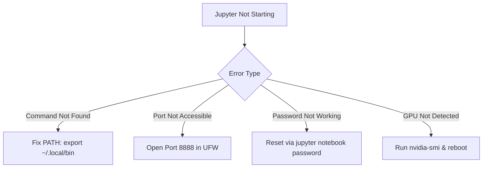

# 🚀 Jupyter Notebook & JupyterLab Setup on Dataoorts GPU (Ubuntu)

This guide explains how to set up **Jupyter Notebook** and **JupyterLab** on a **Dataoorts GPU instance** with secure remote access, GPU support, VS Code integration, and systemd auto-start.

It also includes the **fix for `jupyter: command not found`**, a common issue on fresh Ubuntu servers.

---

## 🗺️ Architecture Overview


---

# 📌 Prerequisites

Before you begin, ensure:

* You have SSH access to your Dataoorts GPU instance
* Optional: VS Code Remote-SSH (recommended)
* System: Ubuntu 20.04 / 22.04
* Python3 installed

---

# 🧩 1️⃣ Update System & Install Dependencies

```bash
sudo apt update -y
sudo apt install python3-pip -y
```

Upgrade pip:

```bash
pip install --upgrade pip
```

---

# 📦 2️⃣ Install Jupyter Notebook & JupyterLab

```bash
pip install jupyter jupyterlab
```

---

# ❗ Fix: `jupyter: command not found`

Ubuntu often doesn’t include `~/.local/bin` in PATH.

### ✅ Add it manually

```bash
echo 'export PATH="$HOME/.local/bin:$PATH"' >> ~/.bashrc
source ~/.bashrc
```

Verify:

```bash
jupyter --version
jupyter-lab --version
```

---

# 🔐 3️⃣ Generate Jupyter Config

```bash
jupyter notebook --generate-config
```

Creates:

```
~/.jupyter/jupyter_notebook_config.py
```

---

# 🔑 4️⃣ Set Jupyter Password

```bash
jupyter notebook password
```

---

# ⚙️ 5️⃣ Configure Jupyter for Remote Access

```bash
nano ~/.jupyter/jupyter_notebook_config.py
```

Add at the bottom:

```python
c = get_config()
c.NotebookApp.ip = '0.0.0.0'
c.NotebookApp.open_browser = False
c.NotebookApp.port = 8888
c.NotebookApp.allow_root = True
c.NotebookApp.allow_remote_access = True
```

Save:

```
CTRL + O → Enter → CTRL + X
```

---

# 🚀 6️⃣ Start Jupyter

Notebook:

```bash
jupyter notebook
```

or JupyterLab:

```bash
jupyter-lab
```

---

# 🌍 7️⃣ Access From Your Browser

Go to:

```
http://<YOUR_PUBLIC_IP>:8888
```

Example:

```
http://38.80.122.156:8888
```

Enter your password.

---

# 🔐 8️⃣ Allow Firewall Traffic (If Required)

```bash
sudo ufw allow 8888/tcp
sudo ufw status
```

---

# 🧲 9️⃣ Recommended: VS Code Remote-SSH Integration

Inside VS Code:

1. Connect using **Remote-SSH**
2. Install **Jupyter extension**
3. Open `.ipynb` files directly
4. Run cells — VS Code uses Jupyter internally (no browser needed)

---

# ⚡ 🔟 Add Handy Shortcuts

```bash
echo "alias jn='jupyter notebook'" >> ~/.bashrc
echo "alias jl='jupyter-lab'" >> ~/.bashrc
source ~/.bashrc
```

Use:

```
jn
jl
```

---

# 🔁 1️⃣1️⃣ Optional – Auto-Start Jupyter On Boot

Create a systemd service:

```bash
sudo nano /etc/systemd/system/jupyter.service
```

Paste:

```ini
[Unit]
Description=Jupyter Notebook Server

[Service]
Type=simple
PIDFile=/run/jupyter.pid
ExecStart=/home/ubuntu/.local/bin/jupyter-lab --config=/home/ubuntu/.jupyter/jupyter_notebook_config.py
User=ubuntu
Group=ubuntu
WorkingDirectory=/home/ubuntu
Restart=always
RestartSec=10

[Install]
WantedBy=multi-user.target
```

Enable:

```bash
sudo systemctl daemon-reload
sudo systemctl enable jupyter
sudo systemctl start jupyter
```

Check:

```bash
sudo systemctl status jupyter
```

---

# 🧪 1️⃣2️⃣ Test GPU Availability

In a notebook cell:

```python
!nvidia-smi
```

If you see:

```
Failed to initialize NVML: Driver/library version mismatch
```

Fix:

```bash
sudo reboot
```

---

# 🧱 Troubleshooting Diagram

